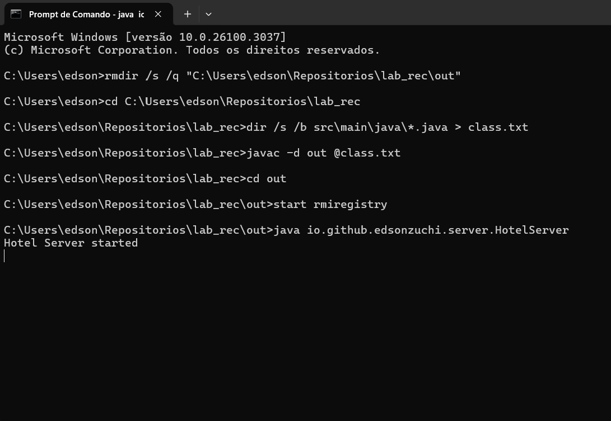
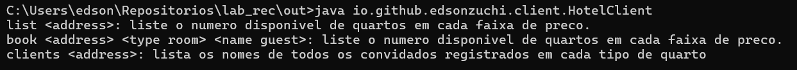
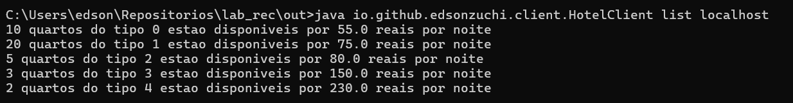
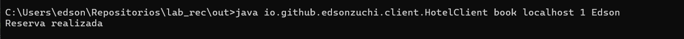
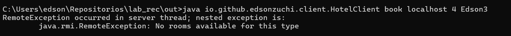
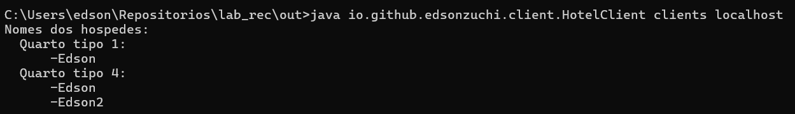

# Reserva de quartos
## Trabalho de recuperação
### Edson Luiz Zucchi

**_Requisitos_**:
- IDE : *Intellij*
- JAVA version: *17*
- Project manager : *Maven*

> Observação
> Substitua _dir_ pelo diretorio do seu projeto, exemplo _C:\Users\edson\Repositorios\lab_rec_


### Compilar os jars

```
rmdir /s /q "dir\out"
cd dir
dir /s /b src\main\java\*.java > class.txt
javac -d out @class.txt
```

### Execução

> Para executar o projeto vai ser necessário a abertura de dois terminais 
> um para o cliente e outro para o servidor

**Servidor**

```
cd dir
cd out
start rmiregistry
java io.github.edsonzuchi.server.HotelServer
```

**Cliente**

```
cd dir
cd out
java io.github.edsonzuchi.client.HotelClient
```

### Referência

[Getting Started Using Java RMI](https://docs.oracle.com/javase/8/docs/technotes/guides/rmi/hello/hello-world.html)

### Demonstração

***Servidor***


***Cliente***

__Help__


__List__


__Book__


__Book error__


__Clients__


### Comentários do funcionamento do código está dentro de cada classe